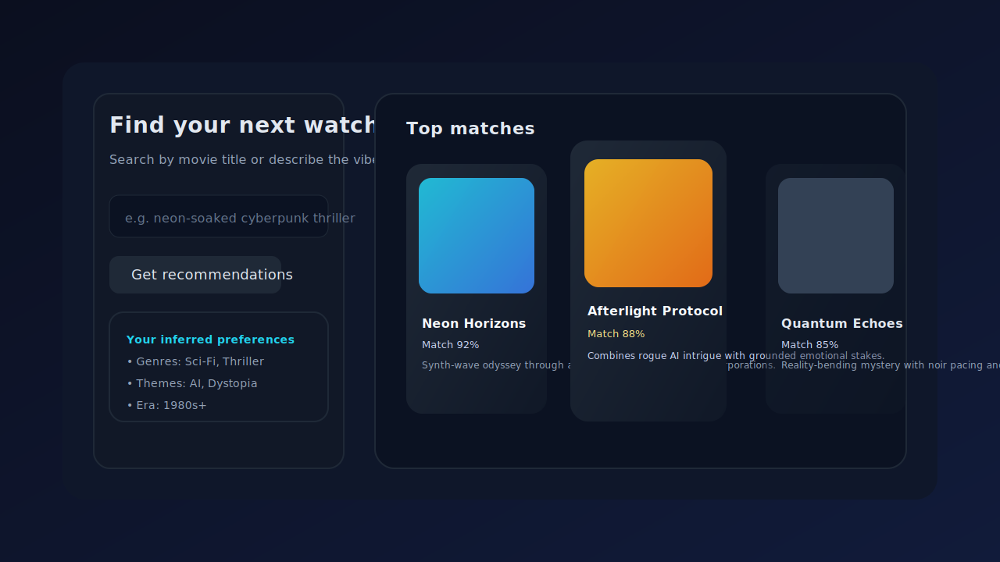

# ZZZ - Movie Recommendation Carousel

This project delivers an interactive movie recommendation experience powered by a lightweight latent semantic model and a modern
Next.js front end. A curated subset of Kaggle movie plots is embedded into a compact latent space (truncated SVD over TF-IDF
features) and enriched with genre plus release-year metadata. The React carousel renders the top matches for a seed movie title or
a free-form description, presenting similarity scores and concise insight strings.

## Getting started

```bash
npm install
npm run dev
```

Visit [http://localhost:3000](http://localhost:3000) to try the carousel. The page loads a default seed automatically so you can
immediately browse results, or you can type your own prompt / movie title and fetch fresh recommendations.

## Preview



> _Animated capture unavailable_: Running the app locally without network access prevents installing the Next.js toolchain in
> this environment, so the repository includes a high-fidelity SVG mock that highlights the layout and insights surfaced in the
> carousel UI. When dependencies are available you can generate your own GIF by starting `npm run dev` and recording the
> interaction with tools such as QuickTime, ScreenToGif, or `ffmpeg` + `imagemagick`.

### Hosting tip

The app is ready to deploy on platforms such as [Vercel](https://vercel.com) or any Node-compatible host:

1. Fork the repository and connect it to your Vercel account.
2. Set the framework preset to **Next.js** (defaults work out of the box).
3. Trigger a production build; Vercel will expose the `/api` routes alongside the React front end.

If you publish a deployment, drop the live URL back into this README so collaborators can explore the carousel without setting up
the development server.

### Available scripts

- `npm run dev` &mdash; start the Next.js development server with hot reloading
- `npm run build` &mdash; produce an optimized production build
- `npm run start` &mdash; launch the built application in production mode
- `npm run lint` &mdash; run Next.js ESLint checks

## Architecture overview

- **Next.js API routes** (`pages/api`) expose `/api/recommendations`, `/api/movies`, and `/api/health`. They share a memoized
  recommender module that loads the dataset, builds TF-IDF vectors, performs truncated SVD, and fuses in genre / year metadata.
- **React front end** (`pages/index.tsx`) renders search controls, an inferred preference profile, and a responsive carousel UI that
  consumes the API. The carousel adapts to different breakpoints and surfaces the similarity scores plus narrative insights.
- **Shared logic** (`lib/recommender.ts`) houses the recommendation engine and exports helper functions for the API routes.
- **Styling** (`styles/globals.css`) applies a cinematic dark theme with responsive layout and accessible focus states.

The app intentionally keeps the ML stack lightweight, relying on matrix factorization and metadata augmentation so it can run
locally without heavyweight dependencies.
