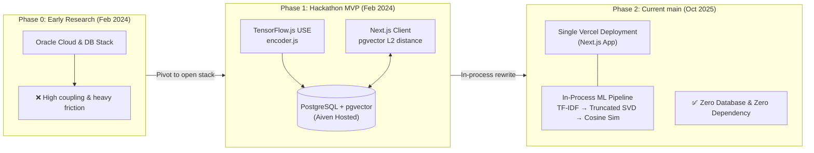

# ZZZ - Movie Recommendation Carousel

This project delivers an interactive movie recommendation experience powered by a lightweight latent semantic model and a modern
Next.js front-end. A curated subset of Kaggle movie plots is embedded into a compact latent space (truncated SVD over TF-IDF
features) and enriched with genre plus release-year metadata. The React carousel renders the top matches for a seed movie title or
a free-form description, presenting similarity scores and concise insight strings.

## Project Evolution (3 Phases)


```mermaid
flowchart LR
    subgraph P0 ["Phase 0: Early Research (Feb 2024)"]
        direction TB
        O1["Oracle Cloud & DB Stack"]
        O2["❌ High coupling & heavy friction"]
        O1 --> O2
    end

    subgraph P1 ["Phase 1: Hackathon MVP (Feb 2024)"]
        direction TB
        TF["TensorFlow.js USE<br/>encoder.js"] --> PG[("PostgreSQL + pgvector<br/>(Aiven Hosted)")]
        C1["Next.js Client<br/>pgvector L2 distance"] <--> PG
    end

    subgraph P2 ["Phase 2: Current main (Oct 2025)"]
        direction TB
        V1["Single Vercel Deployment<br/>(Next.js App)"]
        V2["In-Process ML Pipeline<br/>TF-IDF → Truncated SVD → Cosine Sim"]
        V1 --- V2
        V3["✅ Zero Database & Zero Dependency"]
    end

    P0 -->|Pivot to open stack| P1
    P1 -->|In-process rewrite| P2
```

| Phase | Stack & Architecture | Tradeoffs & Outcome | Roles |
|---|---|---|---|
| **Phase 0** (Feb 2024) | Oracle Cloud Ecosystem | Explored but dropped due to tight coupling & high deployment overhead | Yiwei Zhang (Lead), [Weiran Zhao](https://github.com/weiranzhao97) (Research) |
| **Phase 1** (Feb 2024) | PostgreSQL + pgvector + TensorFlow USE | Working MVP for Global Hack Week; write-up on [DevPost](https://devpost.com/software/zzz-movie-recommender); companion client: [`ZZZ-MovieSearch-Client`](https://github.com/ZZZ-RecSys/ZZZ-MovieSearch-Client) | Yiwei Zhang (Engineering), [Weiran Zhao](https://github.com/weiranzhao97) (Docs & Research), [Shizhe Zhang](https://github.com/zhang-shizhe) (Ideation) |
| **Phase 2** (Oct 2025) | Next.js + In-Process TF-IDF / SVD | Dropped hosted Postgres; entire ML pipeline runs in-process on Vercel with zero database | Yiwei Zhang (Solo rewrite & optimization) |

## Getting started

```bash
npm install
npm run dev
```

Visit [http://localhost:3000](http://localhost:3000) to try the carousel. The page loads a default seed automatically so you can
immediately browse results, or you can type your own prompt / movie title and fetch fresh recommendations.

## Preview


## Live demo

Explore the deployed experience at **[zzz-movie-rec-system.vercel.app](https://zzz-movie-rec-system.vercel.app/)**. The hosted instance matches this repository, so you can browse the carousel, submit your own prompts, and share the link without any local setup.

### Available scripts

* `npm run dev` — start the Next.js development server with hot reloading
* `npm run build` — produce an optimized production build
* `npm run start` — launch the built application in production mode
* `npm run lint` — run Next.js ESLint checks

## Architecture overview

* **Next.js API routes** (`pages/api`) expose `/api/recommendations`, `/api/movies`, and `/api/health`. They share a memoized
  recommender module that loads the dataset, builds TF-IDF vectors, performs truncated SVD, and fuses in genre / year metadata.

* **React front end** (`pages/index.tsx`) renders search controls, an inferred preference profile, and a responsive carousel UI that
  consumes the API. The carousel adapts to different breakpoints and surfaces the similarity scores plus narrative insights.

* **Shared logic** (`lib/recommender.ts`) houses the recommendation engine and exports helper functions for the API routes.

* **Styling** (`styles/globals.css`) applies a cinematic dark theme with responsive layout and accessible focus states.

The app intentionally keeps the ML stack lightweight, relying on matrix factorization and metadata augmentation so it can run
locally without heavyweight dependencies.

### Machine Learning Design & Future Enhancements

The recommendation subsystem follows a **hybrid semantic–metadata architecture**, balancing interpretability, performance, and local deployability:

* **TF-IDF + SVD (Latent Semantic Analysis):**
  Transforms movie plots into a compact latent space (50–300 dimensions). This yields robust similarity even with noisy text while ensuring sub-100 ms latency.

* **Genre / Year Fusion:**
  Genre and release year act as auxiliary constraints, weighted (α≈1.0, β≈0.3, γ≈0.2) to fine-tune results toward user taste and stylistic period.

* **In-Process Model Caching:**
  The recommender module stays warm in memory inside Next.js API routes (Vercel / Node.js server), preventing redundant rebuilds.

* **Retrieval Scaling:**
  For datasets exceeding tens of thousands of titles, approximate-nearest-neighbor (ANN) libraries such as FAISS, Annoy, or HNSW can accelerate cosine-similarity queries.

#### Planned Improvements

| Area                         | Planned Upgrade                                                                    | Expected Benefit                                     |
| ---------------------------- | ---------------------------------------------------------------------------------- | ---------------------------------------------------- |
| **Semantic Embeddings**      | Replace TF-IDF + SVD with `Sentence-Transformer` models (e.g., `all-MiniLM-L6-v2`) | Captures deeper contextual semantics and paraphrases |
| **Hybrid Personalization**   | Introduce implicit feedback weighting (clicks / watch history)                     | Blends content-based and collaborative filtering     |
| **Index Optimization**       | Persist pre-computed latent vectors using FAISS / HNSW index                       | Enables millisecond-scale retrieval at 100 k + items |
| **Explainability Dashboard** | Add 2D PCA / UMAP visualization of latent clusters                                 | Improves transparency and debugging                  |
| **Edge Deployment**          | Package model cache via WASM / WebWorker                                           | Allows full offline use in browsers or Electron      |

> The design keeps the ML layer transparent, auditable, and easy to upgrade — ideal for privacy-sensitive or offline-first deployments while leaving a clean path to more advanced embeddings later on.

